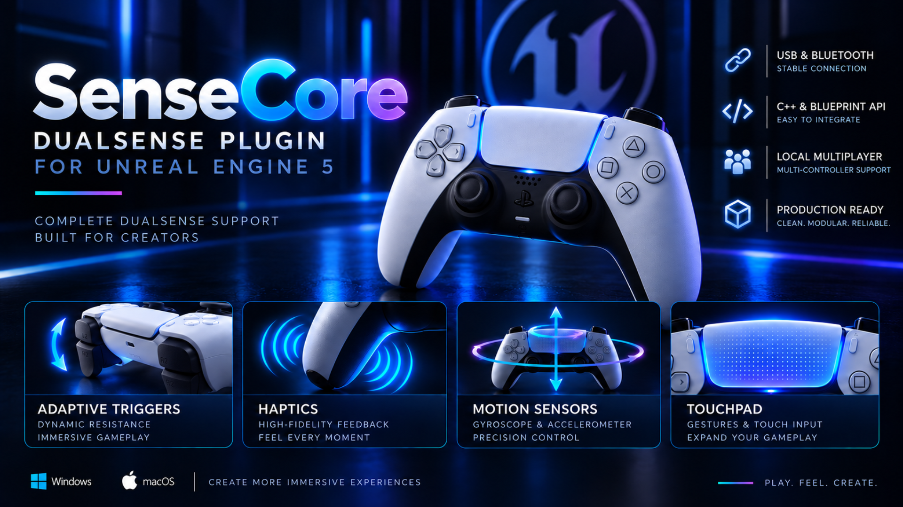

# SenseCore
### DualSense & DualSense Edge Support for Unreal Engine 5

<p align="center">
  
</p>

SenseCore is an Unreal Engine plugin that provides direct access to
DualSense and DualSense Edge controller features through Blueprint and C++ APIs.

Use adaptive triggers, haptics, motion sensors, touchpad input, controller LEDs,
multi-controller routing, device information, and other DualSense-specific
features without implementing low-level HID communication yourself.


---

## Compatibility

| | Support |
|---|---|
| **Unreal Engine** | UE 5.8 |
| **Windows** | Supported |
| **macOS** | Supported |
| **DualSense** | Supported |
| **DualSense Edge** | Supported |
| **USB** | Supported |
| **Bluetooth** | Supported* |
| **Blueprint** | Supported |
| **C++** | Supported |

\* Some controller features depend on the operating system and connection type.
See [Platform Notes](Docs/PLATFORM_NOTES.md) for details.

<!-- TODO:
Before release:
- Confirm the exact Unreal Engine versions officially supported.
- Decide whether to advertise "UE 5.8" or "UE 5.8+".
- Verify every compatibility entry using the final release build.
-->

---

# Documentation

| Guide | Description |
|---|---|
| [Quick Start](Docs/QUICK_START.md) | Install SenseCore and create your first controller effects |
| [Blueprint API](Docs/BLUEPRINT_API.md) | Blueprint node reference |
| [Input Device User Subsystem](Docs/INPUT_DEVICE_USER_SUBSYSTEM.md) | Device, platform-user and local-player routing |
| [Advanced Haptics](Docs/ADVANCED_HAPTICS.md) | Audio and MetaSound-based haptics |
| [Platform Notes](Docs/PLATFORM_NOTES.md) | Windows, macOS, USB and Bluetooth differences |
| [Diagnostics](Docs/DIAGNOSTICS.md) | Device and runtime diagnostic information |
| [Troubleshooting](Docs/TROUBLESHOOTING.md) | Common issues and solutions |
| [API Stability](Docs/API_STABILITY.md) | API compatibility and stability information |

<!-- TODO:
CHECK EVERY LINK ABOVE BEFORE RELEASE.

GitHub paths and filenames are case-sensitive.

Remove any row for a document that does not exist yet,
or create the missing document before publishing.
-->
---

# Features

## Controller Input

Access standard controller input and DualSense-specific controls.

SenseCore provides access to:

- Face buttons
- D-pad
- Analog sticks
- Analog triggers
- Touchpad click
- PS button
- Microphone button
- DualSense Edge rear buttons
- Touchpad contacts

Controller input can be accessed through Unreal Engine's input systems
as well as SenseCore-specific APIs where appropriate.

---

## Adaptive Triggers

Control the resistance and behavior of the L2 and R2 adaptive triggers.

SenseCore provides multiple adaptive trigger effect modes including:

- Feedback
- Weapon
- Vibration
- Slope Feedback
- Trigger reset / Off

Trigger positions and effect parameters can be configured through
Blueprint and C++ APIs.

<!-- TODO:
Add an Adaptive Trigger Blueprint screenshot.

Suggested path:
Images/AdaptiveTriggers/WeaponTrigger.png

Example:

<p align="center">
  
</p>
-->

---

## Haptics & Vibration

SenseCore supports standard controller vibration as well as advanced
audio-based haptics on supported configurations.

Advanced haptics can be integrated with Unreal Engine's audio system
and MetaSounds, allowing controller feedback to be generated from
audio signals.

Possible use cases include:

- Surface feedback
- Weapon effects
- Impacts
- Explosions
- Vehicle feedback
- Procedural vibration
- Audio-driven effects

> Advanced audio-based haptics require a supported connection and platform configuration.

[Advanced Haptics Documentation →](Docs/ADVANCED_HAPTICS.md)

<!-- TODO:
Check that ADVANCED_HAPTICS.md is the actual filename.

Also specify exactly which configurations support Advanced Haptics
after completing the final Windows/macOS + USB/Bluetooth test matrix.
-->

---

## Motion Sensors

Read motion data directly from the controller.

Available sensor information includes:

- Gyroscope
- Accelerometer
- Sensor timestamp
- Sensor temperature

Motion data can be used for:

- Gyro aiming
- Motion-controlled gameplay
- Camera control
- Controller visualization
- Gesture-based mechanics
- Custom motion processing

---

## Touchpad

Access both DualSense touch contacts independently.

Available information includes:

- Touch active state
- Contact ID
- Raw coordinates
- Normalized coordinates
- Touchpad click

This enables mechanics such as:

- Touch gestures
- Drawing
- Cursor control
- Camera input
- Swipe detection
- Two-finger interactions
- Custom touch interfaces

---

## Controller Output

Control supported DualSense output features through Blueprint and C++.

Available functionality includes:

- Lightbar color
- Player LEDs
- Microphone mute LED
- Microphone mute state
- Controller vibration
- Adaptive triggers

<!-- TODO:
Verify which output features are supported for:

- Windows USB
- Windows Bluetooth
- macOS USB
- macOS Bluetooth

Document any differences in PLATFORM_NOTES.md.

Do not advertise a feature as universally supported if it only works
with a specific platform or connection type.
-->

---

## Multiple Controllers & Local Multiplayer

SenseCore includes device and player-routing APIs for projects using
multiple controllers and local players.

Available functionality includes:

- Connected DualSense device discovery
- Input Device ID access
- Platform User ID access
- Controller-to-player routing
- Preferred controller selection
- Local-player based output routing
- Multi-device status
- Press-to-join workflows
- Auto-join workflows

This allows controller-specific effects to be sent to the correct
physical controller in local multiplayer projects.

<!-- TODO:
Before release, stress-test:

- Two DualSense controllers
- DualSense + DualSense Edge
- Controllers connected before PIE
- Controllers connected after PIE
- Disconnect / reconnect
- Local Player creation/removal
- Shipping build multiplayer
-->

---

## Device Information

Query detailed information about connected controllers.

Available information includes:

- Device path
- Connection type
- Product ID
- Input Device ID
- Platform User ID
- DualSense / DualSense Edge identification
- Adaptive trigger support
- Rear button support
- Battery state
- Headset state

SenseCore can also expose Unreal Engine input-device information to help
associate physical controllers with platform users and local players.

---

## Battery

Query controller battery information including:

- Battery level
- Charging state
- Fully charged state
- Battery status

<!-- TODO:
Verify battery reporting behavior over USB and Bluetooth
on every supported platform.
-->

---

## Headset & Microphone State

Query supported controller audio-device information including:

- Headphones connected
- Microphone connected
- Microphone muted
- Status availability

<!-- TODO:
Confirm exactly which platforms/connections provide reliable headset state.
Document limitations in PLATFORM_NOTES.md.
-->

---

## Advanced Haptics Endpoints

SenseCore provides information about compatible audio endpoints used
for advanced haptics.

Available endpoint information can include:

- Endpoint ID
- Friendly name
- Container ID
- Channel count
- Sample rate
- Advanced haptics compatibility

Runtime status information can include:

- Connection state
- Last error code
- Queue underrun frames
- Dropped frames
- Queued frames

This information can be used for debugging advanced haptics setups
and diagnosing audio-device configuration problems.

[Advanced Haptics Documentation →](Docs/ADVANCED_HAPTICS.md)

---

## Diagnostics

SenseCore provides runtime diagnostic information to help identify
controller, routing, HID, and advanced haptics issues.

Diagnostic information can include:

- Connected HID devices
- Input device mappings
- Platform user mappings
- Connection state
- Product and device identifiers
- DualSense Edge detection
- Input configuration
- Force feedback configuration
- Advanced haptics endpoint state
- Queue statistics
- Runtime errors

A diagnostic report can be generated and included with support requests.

<!-- TODO:
Add a screenshot of the final Device Monitor here if desired.

IMPORTANT:
If the Device Monitor shown in promotional material is NOT included
with the distributed plugin, explicitly say so.

Example:
"The Device Monitor shown in promotional material is part of the
SenseCore demo and is not included as a production UI widget."
-->

---

# Getting Started

## 1. Install SenseCore

Copy the SenseCore plugin into your Unreal Engine project's `Plugins`
directory.

Example:

```text
YourProject/
└── Plugins/
    └── SenseCore/
```

Restart Unreal Engine.

If required, enable SenseCore from:

```text
Edit → Plugins
```

and restart the editor.

<!-- TODO:
Verify the exact plugin directory name in the final Fab package.

If the physical plugin directory is NOT "SenseCore", replace the
example above with the real directory name.
-->

---

## 2. Connect a Controller

Connect a DualSense or DualSense Edge controller using USB or Bluetooth.

SenseCore automatically detects compatible connected devices.

For the first test, USB is recommended because it provides access to
the widest set of controller functionality.

<!-- TODO:
Keep the sentence above only if this is accurate for the final release.
-->

---

## 3. Access SenseCore from Blueprint

SenseCore exposes its primary functionality through Blueprint-friendly APIs.

For example, you can retrieve information about connected controllers
and then target a specific physical device.

<!-- TODO:
Add a simple Blueprint screenshot here.

Recommended example:

Get DualSense Subsystem
        ↓
Get Connected DualSense Devices

Suggested path:
Images/Blueprint/GetConnectedDevices.png
-->

For a complete setup walkthrough, continue to:

**[Quick Start →](Docs/QUICK_START.md)**

---

# Platform Support

## Windows

SenseCore supports DualSense and DualSense Edge controllers through
supported USB and Bluetooth configurations.

USB connections can additionally provide access to advanced
audio-based haptics.

<!-- TODO:
FINAL WINDOWS TEST:

[ ] DualSense USB
[ ] DualSense Bluetooth
[ ] DualSense Edge USB
[ ] DualSense Edge Bluetooth

[ ] Buttons
[ ] Sticks
[ ] Analog triggers
[ ] Touchpad
[ ] Gyroscope
[ ] Accelerometer
[ ] Battery
[ ] Headset state
[ ] Lightbar
[ ] Player LEDs
[ ] Microphone LED
[ ] Vibration
[ ] Adaptive triggers
[ ] Advanced haptics

[ ] Connect before Editor launch
[ ] Connect during PIE
[ ] Disconnect
[ ] Reconnect
[ ] Multiple controllers
[ ] Development build
[ ] Shipping build
-->

---

## macOS

SenseCore supports DualSense and DualSense Edge controllers through
supported USB and Bluetooth configurations.

Depending on project configuration, Unreal Engine's native gamepad input
may interact with raw DualSense input.

See [Platform Notes](Docs/PLATFORM_NOTES.md) for configuration details.

<!-- TODO:
FINAL macOS TEST:

[ ] DualSense USB
[ ] DualSense Bluetooth
[ ] DualSense Edge USB
[ ] DualSense Edge Bluetooth

[ ] Buttons
[ ] Sticks
[ ] Analog triggers
[ ] Touchpad
[ ] Gyroscope
[ ] Accelerometer
[ ] Battery
[ ] Headset state
[ ] Lightbar
[ ] Player LEDs
[ ] Microphone LED
[ ] Vibration
[ ] Adaptive triggers
[ ] Advanced haptics

[ ] Connect before Editor launch
[ ] Connect during PIE
[ ] Disconnect
[ ] Reconnect
[ ] Multiple controllers
[ ] Development build
[ ] Shipping build

Document every difference from Windows in PLATFORM_NOTES.md.
-->

---

# Requirements

Current requirements:

- Unreal Engine 5.8
- Windows or macOS
- DualSense or DualSense Edge controller

No official PlayStation SDK is required.

<!-- TODO:
VERIFY BEFORE RELEASE:

[ ] Blueprint-only project works
[ ] C++ project works
[ ] No external installation is required
[ ] Required Unreal Engine plugins are documented
[ ] Required Windows components are documented
[ ] Required macOS configuration is documented

Add if known:

Minimum Windows version: ______
Minimum macOS version: ______

Also verify that:
"No official PlayStation SDK is required."

Keep that sentence only if it remains true for the final distributed package.
-->

---

# Connection & Feature Availability

Not every DualSense feature is necessarily available on every operating
system and connection type.

Feature availability may depend on:

- Operating system
- USB or Bluetooth connection
- Controller model
- Unreal Engine input configuration
- Audio endpoint configuration

For detailed information, see:

**[Platform Notes →](Docs/PLATFORM_NOTES.md)**

<!-- TODO:
Strongly recommended before release:

Create a feature matrix in PLATFORM_NOTES.md:

| Feature | Win USB | Win BT | macOS USB | macOS BT |
|---|---|---|---|---|
| Input | ✓ | ✓ | ✓ | ✓ |
| Adaptive Triggers | ? | ? | ? | ? |
| Vibration | ? | ? | ? | ? |
| Advanced Haptics | ? | ? | ? | ? |
| Lightbar | ? | ? | ? | ? |
| Player LEDs | ? | ? | ? | ? |
| Motion | ? | ? | ? | ? |
| Touchpad | ? | ? | ? | ? |
| Battery | ? | ? | ? | ? |

Replace every "?" only after testing the final release build.
-->

---

# Known Limitations

Feature availability may differ between USB and Bluetooth connections
and between supported operating systems.

Advanced audio-based haptics require a compatible audio endpoint and
supported controller configuration.

<!-- TODO:
THIS SECTION MUST BE COMPLETED BEFORE FAB RELEASE.

Add all known limitations.

Possible items to verify:

- Bluetooth lightbar behavior
- Bluetooth Player LED behavior
- Advanced Haptics over Bluetooth
- macOS Gamepad Input / HID interaction
- DualSense Edge-specific differences
- Battery reporting differences
- Headset reporting differences
- Local multiplayer limitations
- Packaged build differences

Do not hide known limitations.

Clear documentation here will reduce support requests and negative reviews.
-->

For platform-specific behavior, see:

**[Platform Notes →](Docs/PLATFORM_NOTES.md)**

---

# Troubleshooting

If SenseCore does not detect or control a connected device:

1. Verify that the controller is connected to the operating system.
2. Check whether SenseCore detects the device.
3. Verify the connection type.
4. Check the relevant platform configuration.
5. Generate a SenseCore diagnostic report.
6. Review the troubleshooting documentation.

**[Troubleshooting Guide →](Docs/TROUBLESHOOTING.md)**

When reporting an issue, include:

- SenseCore version
- Unreal Engine version
- Operating system
- Controller model
- USB or Bluetooth connection
- Relevant diagnostic report
- Steps required to reproduce the issue

---

# Support

For installation problems, unexpected controller behavior, or bug reports,
check the troubleshooting documentation first:

**[Troubleshooting Guide →](Docs/TROUBLESHOOTING.md)**

<!-- TODO:
CHOOSE A PUBLIC SUPPORT CHANNEL BEFORE RELEASE.

Options:

1. GitHub Issues
2. Epic Developer Community
3. Support email
4. Combination of the above

Then replace this TODO with the real support information.

Example:

## Bug Reports

Bug reports can be submitted through GitHub Issues:

https://github.com/vdemyanchenko/SenseCore-Documentation/issues

Please include a SenseCore diagnostic report when possible.
-->

---

# Reporting Bugs

A useful bug report should include:

```text
SenseCore Version:
Unreal Engine Version:
Operating System:
Controller:
Connection: USB / Bluetooth

Problem:

Steps to Reproduce:
1.
2.
3.

Expected Result:

Actual Result:

Diagnostic Report:
```

This information makes controller, platform, and device-routing issues
significantly easier to reproduce.

---

# Version

**SenseCore:** 1.0.0  
**Documentation:** 1.0  
**Unreal Engine:** 5.8

<!-- TODO:
UPDATE IMMEDIATELY BEFORE FAB SUBMISSION.

Optional:

Release date: YYYY-MM-DD
Last tested: YYYY-MM-DD

Tested Unreal Engine versions:
- 5.8
-->

---

# Changelog

## 1.0.0

Initial release.

<!-- TODO:
After release, keep the changelog concise.

Example:

## 1.0.1

### Fixed
- Fixed controller routing after reconnect.
- Fixed Bluetooth device detection on Windows.

### Improved
- Improved diagnostic reporting.
- Updated documentation.

## 1.1.0

### Added
- New feature...
-->

---

# License

SenseCore is distributed under the license provided with the product
through Fab.

Redistribution or resale of the SenseCore source code or plugin package
outside the terms of the applicable license is not permitted.

<!-- TODO:
Verify the wording of this section against the license under which
SenseCore is actually distributed on Fab.

Do not invent additional restrictions that conflict with the Fab license.
-->

---

# Third-Party Software

SenseCore may include or use third-party software components.

<!-- TODO:
IMPORTANT BEFORE RELEASE:

Review everything inside ThirdParty/.

For every dependency:

[ ] Identify the project
[ ] Identify the license
[ ] Confirm commercial redistribution is allowed
[ ] Include required license/notice files
[ ] Include required attribution
[ ] Verify that no restricted Sony SDK files are distributed

Add the final third-party notices here or link to a dedicated file:

THIRD_PARTY_NOTICES.md
-->

---

# Trademark Notice

DualSense, DualSense Edge, PlayStation, and related names and marks are
trademarks or registered trademarks of Sony Interactive Entertainment Inc.

SenseCore is an independent Unreal Engine plugin and is not affiliated with,
endorsed by, or sponsored by Sony Interactive Entertainment Inc.

Unreal Engine and related marks are trademarks or registered trademarks
of Epic Games, Inc.

<!-- TODO:
Review the final trademark wording before commercial release.

Use the same terminology consistently across:
- README
- Fab listing
- Documentation
- Demo
- Promotional images
-->

---

# About SenseCore

SenseCore is designed to make DualSense-specific functionality accessible
from Unreal Engine without requiring developers to build and maintain their
own low-level controller integration.

The plugin focuses on exposing controller features through practical
Blueprint and C++ APIs while supporting device discovery, local-player
routing, diagnostics, and advanced controller feedback.

---

<p align="center">
  <strong>SenseCore</strong><br>
  Play. Feel. Create.
</p>

<!-- TODO:
AFTER THE FAB PAGE IS PUBLIC:

Add the real product URL here.

Example:

<p align="center">
  <a href="REAL_FAB_URL">View SenseCore on Fab</a>
</p>

Do not add a fake or placeholder MarketplaceURL before the listing exists.
-->
